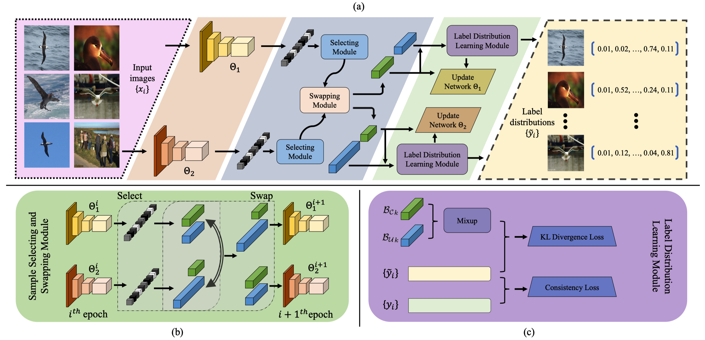

# LCL: A Robust Learning Method for Exploiting Noisy Labels


Introduction
---
This is the source code for our paper **LCL: A Robust Learning Method for Exploiting Noisy Labels**


Framework
---



Installation
---
After creating a virtual environment of python 3.6, run `pip install -r requirements.txt` to install all dependencies


How to use
---

The code is currently tested only on GPU.

- Data preparation
    
    Create a folder `Datasets` in the project root directory and download data into this folder using
    ```
    wget https://web-fgvc-496-5089-sh.oss-cn-shanghai.aliyuncs.com/web-aircraft.tar.gz
    tar -xvf web-aircraft.tar.gz

    # optional
    wget https://web-fgvc-496-5089-sh.oss-cn-shanghai.aliyuncs.com/web-bird.tar.gz
    wget https://web-fgvc-496-5089-sh.oss-cn-shanghai.aliyuncs.com/web-car.tar.gz
    tar -xvf web-bird.tar.gz
    tar -xvf web-car.tar.gz
    ```

- Source code
    
    - If you want to train the whole model from beginning using the source code, please follow subsequent steps:
        - Prepare data
        - Modify `GPU` in the `run.sh`
        - Activate virtual environment (e.g. conda) and then run 
            ```
            bash run.sh
            ```

- Demo
    - If you just want to reproduce our result, please follow subsequent steps:
        - Prepare data
        - Download the following trained model
            ```
            wget https://webly-lcl.oss-cn-shanghai.aliyuncs.com/web_aircraft.pth
            ```
        - Activate virtual environment (e.g. conda) and then run
            ```
            python demo.py --arch resnet50 --model_path web_aircraft.pth --dataset web-aircraft --nclasses 100 --gpu 4
            ```